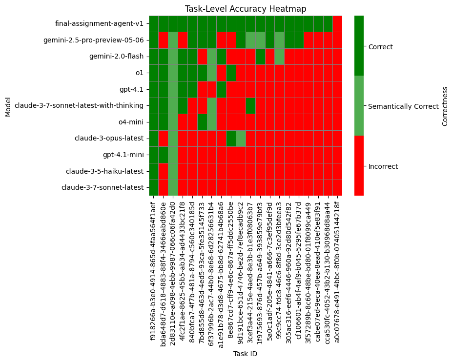

# Agent Performance

# Implementation Highlights

* Uses `gpt-4.1` (main driver) and `gpt-4.1-mini` (selected tools).
* Agents and tools implemented with [smolagents framework](https://huggingface.co/docs/smolagents/en/index).
* Agents orchestration is done with [LangGraph](https://www.langchain.com/langgraph).
* Output tailored specifically for [GAIA Benchmark](https://huggingface.co/spaces/gaia-benchmark/leaderboard).
* Tools:
  * [`openai/whisper-large-v3-turbo`](https://huggingface.co/openai/whisper-large-v3-turbo) for speech recognition,
  * [`docling`](https://docling-project.github.io/docling/) for documents comprehension (web search, PDFs),
  * [`sentence-transformers/all-MiniLM-L6-v2`](https://huggingface.co/sentence-transformers/all-MiniLM-L6-v2) for document semantic chunks embedding,
  * custom document chunks retrieval with cosine similarities and softmax,
  * YouTube video processing with `gpt-4.1` inspired by [OpenAI cookbook](https://developers.google.com/custom-search/v1/overview),
  * Chess problem solving with FEN recognition (`gpt-4.1`) and [`stockfish`](https://stockfishchess.org/),
  * web search via [Google Custom Search API](https://developers.google.com/custom-search/v1/overview),
  * attachments downloaded by agent decision.

# Agents List

`general_assistant` Answers questions for best of knowledge and common reasoning grounded on already known information. Can understand multimedia including audio and video files and YouTube. ToolCallingAgent.

`web_researcher` Answers questions that require grounding in unknown information through search on web sites and other online resources. ToolCallingAgent.

`data_analyst` : Data analyst with advanced skills in statistic, handling tabular data and related Python packages. CodeAgent.

`chess_player`: Chess grandmaster empowered by chess engine. Always thinks at least 100 steps ahead. CodeAgent.

# Custom Tools

`GetAttachmentTool`: Retrieves attachment for current task in specified format. Supported formats are `URL`, `DATA_URL`, `LOCAL_FILE_PATH`, `TEXT`.

`GoogleSearchTool`: Performs a Google web search for query then returns top search results in markdown format.

`GoogleSiteSearchTool`: Performs a Google search within the website for query then returns top search results in markdown format.

`ContentRetrieverTool`: Retrieve the content of a webpage or document in markdown format. Supports PDF, DOCX, XLSX, HTML, images, and more.

`SpeechRecognitionTool`: Transcribes speech from audio.

`YoutubeVideoTool`: Process the video and return the requested information from it.

`ClassifierTool`: Classifies given items into given categories from perspective of specific knowledge area.

`ImageToChessBoardFENTool`: Convert a chessboard image to board part of the FEN.

`chess_engine_locator`: Get the path to the chess engine binary. Can be used with `chess.engine.SimpleEngine.popen_uci` function from `chess.engine` Python module.

# Space Configuration

Check out the configuration reference at https://huggingface.co/docs/hub/spaces-config-reference